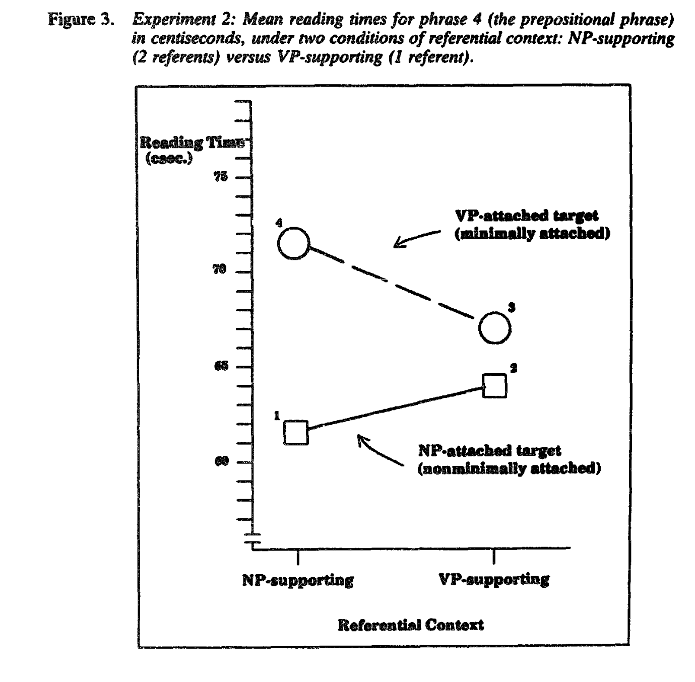

```{r setup, include=FALSE}
knitr::opts_chunk$set(echo = FALSE, warning = F, message = F)
knitr::opts_chunk$set(dev = "png", dev.args = list(type = "cairo-png"))
options(knitr.table.format = "html")
knitr::opts_chunk$set(echo = F)
library(tidyverse)
library(viridis)
library(Replicate)
library(metafor)
library(esc)
library(here)
library(brms)
library(rstan)
library(googledrive)
library(glmnet)
library(tidybayes)
library(ggstance)
library("lattice")
library(reshape2)
library(ggrepel)
library(ggthemes)
library(knitr)
library(cowplot)
library(jsonlite)
rstan_options(auto_write = TRUE)
options(mc.cores = parallel::detectCores())

theme_set(theme_bw())

dat_loc <- "as-maze/data/as_expt-trials.csv"

mod_loc <- "as-maze/code/models"
```

# Background

Altmann and Steedman (1988) looks at reading times at the disambiguating words for either VP or NP attached with-phrases as a function of the context. 
Their items are in the appendix, and look like this: 

2;setup;A mechanic walked up to a car carrying a monkey wrench. He thought he’d have to change a tyre. 

2;1-context;On examining the car he found that there was a tyre which had a faulty valve and a **fuel line** which had a small hole in it. 

2;2-context;On examining the car he found that there was a tyre which had a faulty valve and a **tyre** which had a small hole in it. 

2;NP;The mechanic changed the tyre **with the faulty valve** but it took a long time.

2;VP;The mechanic changed the tyre **with the monkey wrench** but it took a long time.

There are two setup sentences that introduce a character who has a tool and what they will do, followed by a context sentence that either (1-context) sets up two different nouns, or two of the same noun with different characteristics (2-context). 

In the last sentence, the person does something to the first-named entity, and there is either a with-phrase identifying the entity (NP) or a with-phrase about the tool used (VP). 

They predict (and fine) an interaction where 2-context NP and 1-context VP are more felicitous (faster to read) that the reverses. 

**Their experiment 2 uses phrase by phrase reading time and finds effects on the with-phrase, as well as after. **

Notably this means their materials are designed to have same length with phrases across NP and VP pairs, but ** items vary whether the nouns are two words or one word ** (and in one item, there's one of each...). This is not ideal for Maze, but I went with it anyway, considering all the words after the "the" in the prepositional object to be the "critical words" that we analyse. 

Their materials are also a bit dated and a bit violent at times and also use British spelling. I chose to leave it all as was. 

# Experiment summary

I constructed Maze distractors and set up a jsPsych experiment. Participants read instructions and completed one practice sentence in the Maze before proceeding to experiment. 

Each participant saw **16 of the 32 items, 4 in each condition**, randomized. There were no fillers (based on pilot participants not discerning the purpose of the experiment) for time reasons. 

I recruited 100 participants from Prolific. 

```{r}
raw <- read_csv(here(dat_loc)) |>
  select(-proliferate.condition)


free_response <- raw |>
  filter(is.na(correct)) |>
  filter(!is.na(response)) |>
  filter(is.na(stimulus)) |>
  select(workerid, response) |>
  mutate(response = str_replace_all(response, "\\{", "") |> str_replace_all("\\}", "") |> str_replace_all("'", '"')) |>
  separate(response, into = c("blah", "blah1", "blah2", "blah3", "blah4", "blah5"), sep = '", "')

good_stuff <- raw |>
  filter(!is.na(correct)) |>
  select(
    workerid, correct, cumrt, distractors, order, rt, trial_index, words
  ) |>
  mutate(workerid = as.factor(workerid)) |>
  group_by(workerid, trial_index) |>
  mutate(across(everything(), ~ str_replace_all(.x, "\\['", '\\["'))) |>
  mutate(across(everything(), ~ str_replace_all(.x, "',", '",'))) |>
  mutate(across(everything(), ~ str_replace_all(.x, " '", ' "'))) |>
  mutate(across(everything(), ~ str_replace_all(.x, "'\\]", '"\\]'))) |>
  mutate(correct = map(correct, fromJSON)) |>
  mutate(cumrt = map(cumrt, fromJSON)) |>
  mutate(distractors = map(distractors, fromJSON)) |>
  mutate(order = map(order, fromJSON)) |>
  mutate(rt = map(rt, fromJSON)) |>
  mutate(words = map(words, fromJSON)) |>
  unnest_longer(c("correct", "cumrt", "words", "distractors", "order", "rt"))

sentences <- good_stuff |>
  select(words, workerid, trial_index) |>
  ungroup() |>
  group_by(workerid, trial_index) |>
  summarize(sentence = str_c(words, collapse = " ", sep = ""))

post_maze <- read_delim(here("as-maze/materials/post_maze.txt"), col_names = c("type", "number", "sentence", "blah", "blahblah"), ";") |> select(-blah, -blahblah)
critical <- read_delim(here("as-maze/materials/labelled.txt"), ";", col_names = c("type", "number", "critical")) |> select(-X4)

with_labels <- good_stuff |>
  left_join(sentences) |>
  left_join(post_maze) |>
  separate(number, c("number", "subpart")) |>
  mutate(number = as.numeric(number)) |>
  left_join(critical) |>
  filter(!is.na(type))

context_condition <- with_labels |>
  select(workerid, type, number) |>
  unique() |>
  filter(type %in% c("1-context", "2-context")) |>
  rename(context = type)
```

# Checks 
## Overall error rate

Participants accuracy was generally good. Per a pre-registraction, I excluded participants with overall Maze accuracy rates less than .9 (based on pilot where are 4 got 95%+, and other recent papers reporting 97% accuracy). 
We are left with 88 participants. 

```{r}
with_labels |>
  group_by(workerid) |>
  summarize(m = mean(correct)) |>
  ggplot(aes(x = m)) +
  geom_histogram() +
  geom_vline(xintercept = .9, color = "red") +
  labs(x = "Mean Maze accuracy")
```

## Exclusions

We only include participants who completed the experiment, had an accuracy above 90%. We exclude words with RTs >200 or <3000. 

```{r}
include_error <- with_labels |>
  group_by(workerid) |>
  summarize(m = mean(correct)) |>
  filter(m > .9)
# 88 people included

# with_labels |> inner_join(include_error |> select(workerid)) |> select(workerid, number) |> unique() |> group_by(workerid) |> tally() |> filter(n==48) #all of these finished

filtered <- with_labels |>
  inner_join(include_error |> select(workerid)) |>
  filter(rt > 200) |>
  filter(rt < 3000)
```

## Speed

Participants overall RTs on items they got correct. Average speeds vary considerably per individuals. 

```{r}
filtered |>
  filter(correct == 1) |>
  ggplot(aes(x = reorder(workerid, rt), y = rt)) +
  geom_point(alpha = .005) +
  stat_summary(fun.data = "mean_cl_boot") +
  theme(axis.ticks.x = element_blank(), axis.text.x = element_blank()) +
  labs(x = "Participant") +
  scale_y_continuous(breaks = seq(500, 2000, 250))
```

Participants tend to get slightly faster over time. 

```{r}
filtered |>
  group_by(workerid, trial_index) |>
  summarize(m = mean(rt)) |>
  ggplot(aes(x = trial_index, y = m, group = workerid)) +
  geom_smooth(se = F) +
  labs(y = "RT", x = "Trial")
```

# Main graph

I confirm that participants are generally correct on the critical words!


```{r}
context_condition <- filtered |>
  ungroup() |>
  select(workerid, type, number) |>
  unique() |>
  filter(type %in% c("1-context", "2-context")) |>
  rename(context = type)

critical_only <- filtered |>
  filter(type %in% c("NP", "VP")) |>
  mutate(split_critical = str_split(critical, " ")) |>
  rowwise() |>
  mutate(parts = length(split_critical)) |>
  filter(words %in% split_critical) |>
  left_join(context_condition)
```


```{r}
critical_only |>
  group_by(workerid) |>
  summarize(m = mean(correct)) |>
  ggplot(aes(m)) +
  geom_histogram()
```

Graphs show bootstrapped 95% CIs. 

Including both correct and incorrect RTs, we recover an overall interaction pattern. 

```{r}
ggplot(critical_only, aes(x = type, y = rt, color = context)) + # geom_point(alpha=.05,position=position_jitterdodge(jitter.width=.3,dodge.width=.7))+
  stat_summary(fun.data = "mean_cl_boot", position = position_dodge(width = .7))
```

It is quite similar if we only include correct RTs


```{r}
ggplot(critical_only |> filter(correct == 1), aes(x = type, y = rt, color = context)) + # geom_point(alpha=.05,position=position_jitterdodge(jitter.width=.3,dodge.width=.7))+
  stat_summary(fun.data = "mean_cl_boot", position = position_dodge(width = .7))
```

```{r}
critical_only |> filter(correct == 1) |> 
  mutate(type=str_c(type,"-modifier"),
         context=str_c(str_sub(context,1,1),"-referent context")) |> ggplot( aes(x = type, y = rt, shape = context, color=context)) + 
  stat_summary(fun.data = "mean_cl_boot", position = position_dodge(width = .7))+
  labs(y="Reaction time (ms)", x="", shape="")+
      #guides(color = guide_legend(nrow=1, byrow=T, override.aes = list(linetype = 0, alpha=1, size=.7) ) )+
    guides(color = guide_legend("Treatment & State", override.aes = list(linetype = 0, alpha=1, size=.7)),
         shape = guide_legend("Treatment & State", override.aes = list(linetype = 0, alpha=1, size=.7))) +
  scale_color_solarized()+
  theme_bw()+
  theme(legend.position = "bottom",
        legend.title=element_blank(),
        axis.title.x=element_blank(),
        panel.grid.minor = element_blank(),
        panel.grid.major.x=element_blank(),
        axis.text.x=element_text(size=14, color="black"),
        axis.title.y=element_text(size=14),
        axis.text.y=element_text(size=12, color="black"),
        legend.text = element_text(size=14))

ggsave(here("write-ups/hsp_as.png"),width=5, height=3)
```

Compare their figure 3: 

```{r}

```

So they find the ordering of (long to short):

* VP + 2-context
* VP + 1-context
* NP + 1-context
* NP + 2-context

While we find:

* NP + 1-context
* NP + 2-context
* VP + 2-context 
* VP + 1-context 

That is, we find the main NP/VP effect reversed. This could be due to Maze being more forced incrementally, or slowdowns appearing on different words? 


Because of the different types of sentences, it's not clear how we should expect localization to split for the two-part nouns (in some cases the adjective may or may be sufficient?)
For this we also exclude the one item with one two-word and one one-word. 

```{r}
# ggplot(critical_only, aes(x=type, y=rt, color=context))+  stat_summary(fun.data="mean_cl_boot", position=position_dodge(width=.7))+facet_wrap(~parts)

filtered |>
  filter(type %in% c("NP", "VP")) |>
  separate(critical, c("crit1", "crit2")) |>
  rowwise() |>
  filter(words == crit1 | words == crit2) |>
  mutate(part = case_when(
    is.na(crit2) ~ "singleton",
    words == crit1 ~ "first",
    words == crit2 ~ "second"
  )) |>
  # filter(number!=1) |>
  left_join(context_condition) |>
  ggplot(aes(x = type, y = rt, color = context)) +
  stat_summary(fun.data = "mean_cl_boot", position = position_dodge(width = .7)) +
  facet_wrap(~part)
```

So, we're seeing roughly the same pattern on all of them, although less of an NP difference on the one-word ones (note wide error bars everywhere)

```{r}
critical_all <- filtered |>
  mutate(split_critical = str_split(critical, " ")) |>
  rowwise() |>
  mutate(is_critical = (type %in% c("NP", "VP") & words %in% split_critical)) |>
  left_join(context_condition)

# nrow(critical_only)
# nrow(critical_all |> filter(is_critical))

# critical_only |> group_by(context) |> summarize(m=mean(rt))

# critical_only |> group_by(type) |> summarize(m=mean(rt))

# critical_only |> group_by(context, type) |> summarize(m=mean(rt))
```

# Models

looking *only* at critical words: 
RT ~ type * context + (type * context|item)+(type * context|person)

We sum code with:

*  NP -.5, VP +.5 (so effect is VP over NP)
* 1-context -.5, 2-context +.5 (so effect is 2-context over 1) 

We use weakly regularizing priors. 

## Primary model

including both correct and incorrect responses

```{r}
for_mod <- critical_all |>
  mutate(
    type.numeric = case_when(
      is_critical == F ~ 0,
      type == "NP" ~ -.5,
      type == "VP" ~ .5
    ),
    context.numeric = case_when(
      is_critical == F ~ 0,
      context == "1-context" ~ -.5,
      context == "2-context" ~ .5
    ),
    item = as.character(number),
    participant = as.character(workerid)
  ) |>
  ungroup() |>
  select(rt, correct, type.numeric, context.numeric, item, participant, is_critical)
```

```{r}
priors <- c(
  prior(normal(800, 200), class = "Intercept"),
  prior(normal(0, 100), class = b),
  prior(normal(0, 200), class = sd, coef = Intercept, group = participant),
  prior(normal(0, 100), lb = 0, class = sd),
  prior(lkj(1), class = cor)
)
```

```{r}
# primary analysis

m1 <- brm(
  rt ~ type.numeric * context.numeric +
    (type.numeric * context.numeric | item) +
    (1 + type.numeric * context.numeric | participant),
  data = for_mod |> filter(is_critical),
  prior = priors,
  file = here(mod_loc, "m1"),
  control = list(adapt_delta = .99)
)
```
```{r}
summary(m1)
```

## Additional models


### Only correct

It's slightly clearer if we filter for only the correct answers

```{r}
m2 <- brm(
  rt ~ type.numeric * context.numeric +
    (type.numeric * context.numeric | item) +
    (1 + type.numeric * context.numeric | participant),
  data = for_mod |> filter(is_critical) |> filter(correct == 1),
  prior = priors,
  file = here(mod_loc, "m2"),
  control = list(adapt_delta = .99)
)
summary(m2)
```

```{r}
# library(lme4)
#
# m1_lm <- lmer(rt ~ type.numeric*context.numeric +
#             (type.numeric*context.numeric|item)+
#             (1+type.numeric*context.numeric|participant),
#           data=for_mod |> filter(is_critical))
# boundary singular: right that's why I don't use lmer, I forgot
```

### Sum multi-word

As mentioned, there's some question of what to do with the multi-word versus one-word stuff. Here we 

* filter for only correct answers
* add up the RTs
* add a predictor for whether it was multiword (because multi-word will be longer RTs overall)

```{r}
grouped_mod <- for_mod |>
  filter(is_critical) |>
  group_by(item, participant, type.numeric, context.numeric) |>
  summarize(correct = sum(correct), n = n(), rt = sum(rt)) |>
  filter(correct == n) |>
  mutate(multi = (n > 1))

m_grouped <- brm(
  rt ~ type.numeric * context.numeric + multi +
    (type.numeric * context.numeric | item) +
    (1 + type.numeric * context.numeric + multi | participant),
  data = grouped_mod,
  prior = priors,
  file = here(mod_loc, "m_grouped"),
  control = list(adapt_delta = .99)
)
```
```{r}
summary(m_grouped)
```


### Residualize

Using length + freq as predictors per-participant in an lm, then using those (fixef estimates)  to calculate a "predicted" value for critical words and subtracting that off. 

```{r}
freq <- read_csv("wordfreq.csv") |>
  select(-`...1`) |>
  mutate(
    center_freq = scale(freq, scale = F)[, 1],
    center_len = scale(str_length(words), scale = F)[, 1]
  )

residual_preds <- critical_all |>
  left_join(freq) |>
  filter(!is_critical) |>
  filter(correct == 1) |>
  ungroup() |>
  select(workerid, center_freq, center_len, rt) |>
  group_by(workerid) |>
  nest() |>
  rowwise() |>
  mutate(preds = list(lm(rt ~ center_freq + center_len, data = data)$coefficients)) |>
  select(-data) |>
  unnest_wider(preds, names_sep = "_")
```

```{r}
residuals <- critical_all |>
  filter(is_critical) |>
  filter(correct == 1) |>
  left_join(freq) |>
  left_join(residual_preds) |>
  mutate(
    predicted = `preds_(Intercept)` + center_freq * preds_center_freq + center_len * preds_center_len,
    resid = rt - predicted
  ) |>
  mutate(
    type.numeric = case_when(
      type == "NP" ~ -.5,
      type == "VP" ~ .5
    ),
    context.numeric = case_when(
      context == "1-context" ~ -.5,
      context == "2-context" ~ .5
    ),
    item = as.character(number),
    participant = as.character(workerid)
  ) |>
  ungroup()


ggplot(residuals, aes(x = type, y = resid, color = context)) + # geom_point(alpha=.05,position=position_jitterdodge(jitter.width=.3,dodge.width=.7))+
  stat_summary(fun.data = "mean_cl_boot", position = position_dodge(width = .7))
```

```{r}
#library(lme4)
#lm_resid <- lmer(resid ~ type.numeric * context.numeric + (1 | item) + (1 | participant), data = residuals)

#lm_rt <- lmer(rt ~ type.numeric * context.numeric + (1 | item) + (1 | participant), data = residuals)
```

```{r}
m_resid <- brm(
  resid ~ type.numeric * context.numeric +
    (type.numeric * context.numeric | item) +
    (1 + type.numeric * context.numeric | participant),
  data = residuals,
  prior = priors,
  file = here(mod_loc, "m_resid"),
  control = list(adapt_delta = .99)
)
```

### Residualize, then sum

```{r}
# resid and group
grouped_residuals <- critical_all |>
  filter(is_critical) |>
  left_join(freq) |>
  left_join(residual_preds) |>
  mutate(
    predicted = `preds_(Intercept)` + center_freq * preds_center_freq + center_len * preds_center_len,
    resid = rt - predicted
  ) |>
  mutate(
    type.numeric = case_when(
      type == "NP" ~ -.5,
      type == "VP" ~ .5
    ),
    context.numeric = case_when(
      context == "1-context" ~ -.5,
      context == "2-context" ~ .5
    ),
    item = as.character(number),
    participant = as.character(workerid)
  ) |>
  ungroup() |>
  group_by(item, participant, type.numeric, context.numeric) |>
  summarize(correct = sum(correct), n = n(), resid = sum(resid)) |>
  filter(correct == n) |>
  mutate(multi = (n > 1))
```

```{r}
m_group_resid <- brm(
  resid ~ type.numeric * context.numeric + multi +
    (type.numeric * context.numeric | item) +
    (1 + type.numeric * context.numeric | participant),
  data = grouped_residuals,
  prior = priors,
  file = here(mod_loc, "m_group_resid"),
  control = list(adapt_delta = .99)
)

summary(m_group_resid)
```
